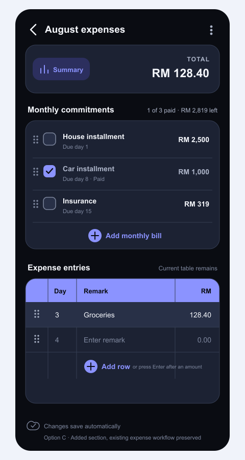

# Monthly Commitments Section

Status: implemented with approved design Option C.



Editable vector source: [monthly-expense-checklist-option-c.svg](../assets/design/monthly-expense-checklist-option-c.svg)

## Decision

Add a separate **Monthly commitments** checklist to an expense note. This is an additive section and must not replace or weaken the current expense workflow.

The existing expense note keeps:

- its total summary and Summary action;
- the Day, Remark, and currency-aware expense table;
- editable rows, three-line Remark wrapping, drag-to-reorder, and confirmed drag-to-delete;
- recycle-bin drag deletion that always requires confirmation, including its accessibility action;
- local persistence and 800 ms auto-save.

## Placement

Place the new section after the combined Summary/Total card and before the existing expense table:

1. Existing Summary action and expense total on the same row
2. New monthly commitments checklist
3. Existing expense-entry table
4. Existing save status

The Summary action sits on the left of the total row. The `TOTAL` label and selected-currency amount are right-aligned. Do not show a separate `Monthly categories` heading or saved-category count on the main screen.

## Monthly commitments section

The section header shows:

- `Monthly commitments`
- progress such as `1 of 3 paid`
- the remaining unpaid amount, such as `$ 2,819.00 left`

Each commitment row contains:

- the existing drag-handle pattern;
- an accessible Paid checkbox;
- the bill name;
- an optional due day;
- an amount in the note's selected currency aligned to the right.

Example rows:

| Paid | Due day | Commitment | $ |
| --- | ---: | --- | ---: |
| No | 1 | House installment | 2,500.00 |
| Yes | 8 | Car installment | 1,000.00 |
| No | 15 | Insurance | 319.00 |

The example totals are:

- Commitments: $ 3,819.00
- Paid: $ 1,000.00
- Remaining: $ 2,819.00

## Interaction rules

- Checked means the commitment has been paid for the month represented by this note.
- Checking a row keeps it visible and updates the paid count and remaining amount immediately.
- A checked row remains part of the commitments total.
- Checking a commitment does not automatically create an expense-table row, preventing duplicate amounts.
- `Add monthly bill` adds a commitment without affecting existing expense rows.
- `Save for next note` stores a reusable copy of the current bill names, due days, and amounts in local app storage. Paid state and note-specific IDs are not stored in the reusable copy.
- When an expense note has no monthly commitments, `Apply` offers the last saved bill list. Applying creates new local IDs and marks every copied bill unpaid without changing the source expense note.
- Reordering and deletion reuse the existing expense-row gestures: a full-width insertion gap previews the drop position, and releasing over the large recycle-bin target opens a confirmation before deleting the bill.
- There is no long-press-to-delete interaction.
- Checkbox and row actions must keep at least a 44 × 44 point touch target and have descriptive accessibility labels.
- Paid state must use a visible checkmark and text/progress feedback; color alone is not sufficient.

## Data shape for implementation

Store commitments inside the expense note's versioned JSON payload, independently from `rows`:

```json
{
  "currency": "USD",
  "monthlyCommitments": [
    {
      "id": "local-base36-id",
      "day": "1",
      "remark": "House installment",
      "amount": "2500.00",
      "isPaid": false
    }
  ]
}
```

Payload version 6 defaults `monthlyCommitments` to an empty array and `currency` to `USD` for existing notes. No new repository methods are required because expense-note content remains versioned JSON. Commitments also appear in expense PDF and image exports.

Settings stores the default currency for newly created expense notes. Changing
that setting asks whether to keep existing notes unchanged or apply the new
currency metadata to all active private/owned expense notes. A note can still
override the setting by pressing its amount-column header. These actions relabel
the stored amounts only; they do not calculate exchange rates or change numbers.
Both entry points use the searchable, complete current ISO 4217 Currency & Funds
list (SIX List One, published 2026-01-01).

The reusable last-saved list is separate from note content and is stored locally in AsyncStorage under `@locknote_monthly_commitment_template`. Its version 1 payload contains only `day`, `remark`, and `amount`.

## Totals and existing behavior

Commitment totals are displayed inside the new section. The current expense total continues to represent only rows recorded in the existing expense table. This avoids changing current calculations or counting a commitment twice.

The Grand total shown by the editor and expense-note cards combines daily expense rows with checked monthly commitments only. Unchecked commitments remain visible in the checklist and remaining balance but do not contribute to Grand total.

## Paid-state reset

- Paid state is kept per note and a confirmed `Reset paid status` action marks every commitment unpaid.
- Applying the last saved bill list to another expense note always starts with every checkbox reset.
- Avoid silently resetting checkboxes by calendar date because a user may still be finishing the previous month's note.

## Out of scope for the first implementation

- Replacing the existing expense table
- Automatically creating expense rows when a bill is checked
- Notifications or payment reminders
- Automatic calendar-based checkbox reset
